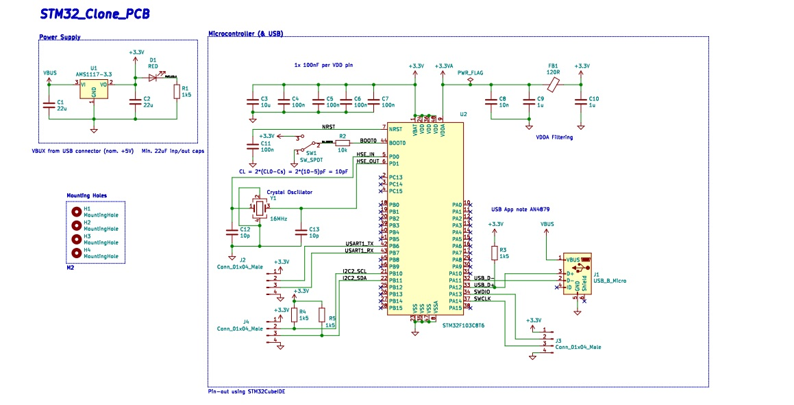
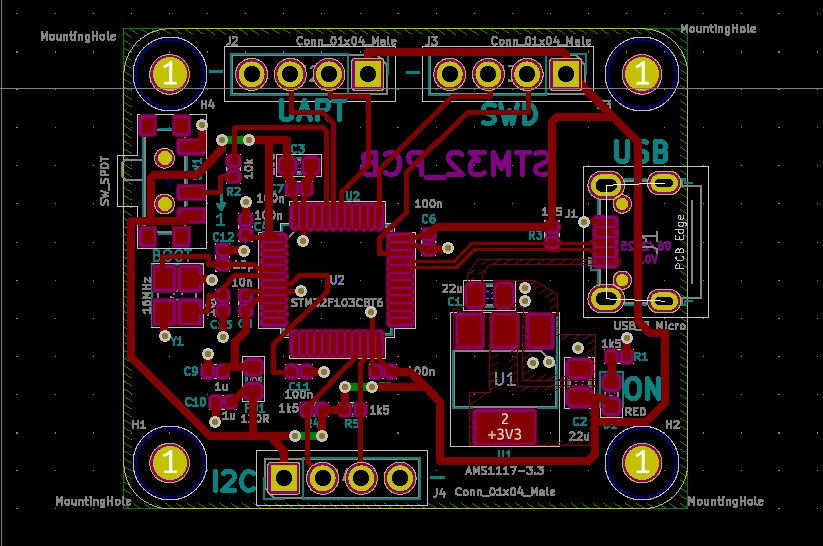
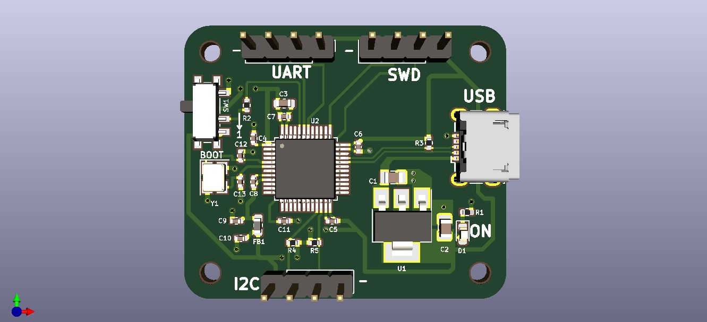

# STM32 PCB Design Project

## STM32F103C8T6 Dev Board (Custom PCB)

This repository contains the complete KiCad project files for a custom development board based on the **STM32F103C8T6** microcontroller, 
commonly used in embedded systems and ARM Cortex-M3 learning platforms.

Designed by: **Chirag Wadkar**  
Toolchain: **KiCad 5.1.15**

---

## 🔧 Features & Specifications

- **Microcontroller**: STM32F103C8T6 (ARM Cortex-M3, 72 MHz, 64 KB Flash, 20 KB RAM)
- **Voltage Regulation**: AMS1117-3.3 LDO with LED power indicator
- **Power Supply**: USB Micro-B (VBus) → 3.3V regulated
- **External Oscillator**:
  - 16 MHz crystal connected to PD0 (HSE_IN) & PD1 (HSE_OUT)
- **USB Interface**:
  - USB Micro-B connected to PA11 (D-) and PA12 (D+)
  - 1.5kΩ pull-up resistor on D+
- **Communication**:
  - UART: PB6 (TX), PB7 (RX)
  - I2C: PB10 (SCL), PB11 (SDA)

---

## 📷 Screenshots

### 🔌 Schematic View

### 💻 PCB Layout

### 🧱 3D Render

---

## 🔌 Powering & Programming

- **Power Input**: USB Micro-B (VBus 5V → Regulated to 3.3V)
- **Programming Methods**:
  - Via USB (DFU mode)
  - External SWD programmer via SWDIO/SWCLK pins.
